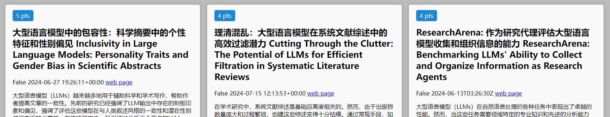
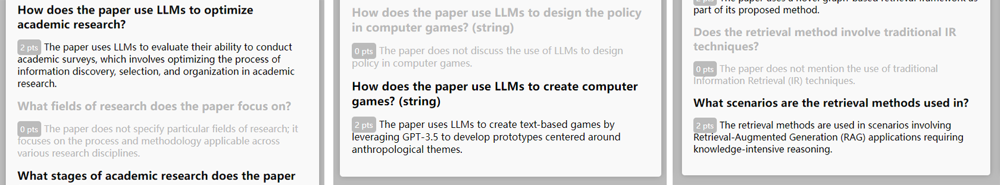
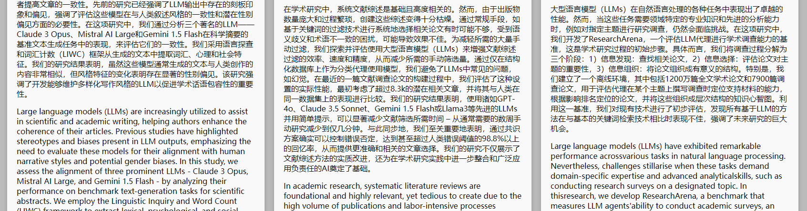

# PaperWard


Say goodbye to endless scrolling through research papers! With PaperWard, you can set a watch on key sites like ArXiv to stay up-to-date effortlessly on the latest developments in your field. 

PaperWard is your personal research assistant, automatically fetching papers, analyzing them based on your custom questions, and delivering concise summaries with relevant findings.


## Key Features

### Automated Paper Fetching with Relevance Ranking

No more manual browsing! PaperWard continuously retrieves the latest papers that match your interests from supported websites* using your custom queries. 

It also prioritizes papers based on their relevance to your defined criteria, allowing you to focus only on the most pertinent research.




### Customizable, User-Driven Analysis

Skip the irrelevant details! Define the questions you care about, and PaperWard will read each paper and answer these questions for you.



### Built-In Translation

Break the language barrier! PaperWard translates paper information into your preferred language**, while displaying original text at the same time.



---

*Currently supports ArXiv abstracts only.  
**Supports simplified Chinese translation at this time.

## Installation and Requirements
This project runs well on Python 3.12 on Windows. We have not tested it on other platforms.
```
pip install arxiv requests lxml openai retrying PyYAML SQLAlchemy pymed streamlit
```

You need to get an OpenAI API key to use PaperWard. You can sign up for an API key at https://platform.openai.com/signup. Once you have the key, you can set it as an environment variable `OPENAI_API_KEY`.

```bash
export OPENAI_API_KEY=<your_openai_api_key>
```

PaperWard uses `gpt-4o` as the default LLM model. You can change it by modifying the source code in `utils/llm_handler.py`.

Initiate Streamlit by running the following command:

```bash
streamlit hello
```

## Usage

Start the app with the following command:

```bash
streamlit run app.py
```

Responding to your query, the app will download the latest papers from the web and analyse them using the user-defined questions. The answers will be stored in a database named `papers.db`. Then the papers and their answers will be displayed in the app. All papers are ranked by the relevance of the questions to the papers.


## Call for Contributions!

Apparently, the project is still at its early stages and has a lot of room for improvement. We welcome contributions from the community to make PaperWard more powerful and user-friendly. Here are some of the areas where you can contribute:

- **Support for more websites**: Currently, PaperWard only supports ArXiv and PubMed. We would like to add support for more websites like Semantic Scholar, IEEE Xplore, etc.

- **Support for more languages**: Currently, PaperWard only supports simplified Chinese. We would like to add support for more languages.

- **Support for dynamic question update**: Currently, if you change the questions in the config file, previously-fetched papers will not be re-analyzed. We would like to add support for dynamic question updates.

- **Support for more question types**: Currently, PaperWard only supports simple questions. We would like to add support for more complex questions like multiple-choice questions, etc.

- **More user-friendly interface**: Currently, PaperWard only generates a static HTML file as the report. We would like to add support for more interactive interfaces.
